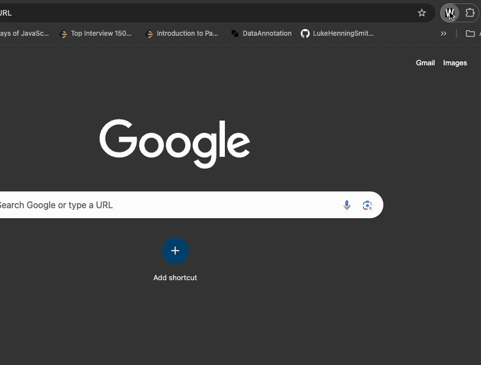
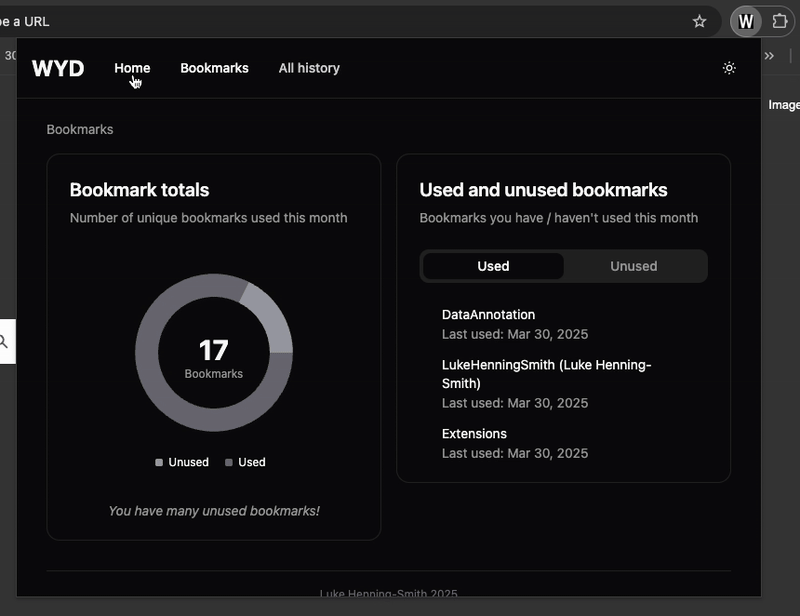
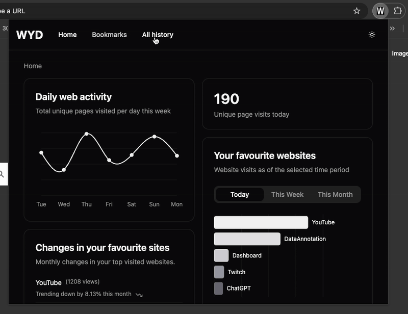
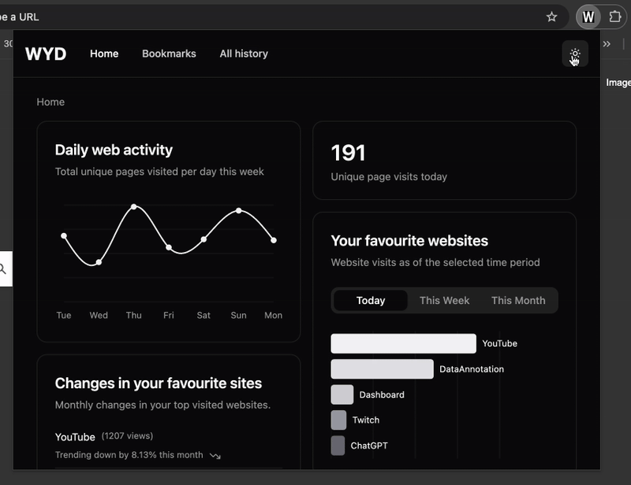
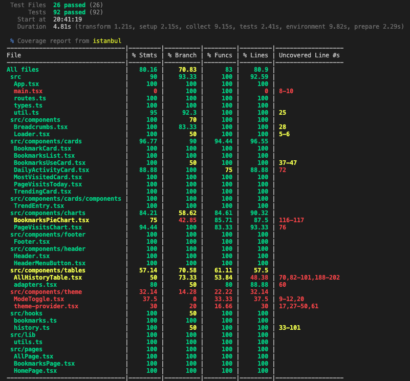

# WYD? - (What You Doing?)

**_WYD?_** is a Chrome extension designed to help users reflect on their daily browsing and bookmark habits by providing clear and insightful metrics in an aesthetic dashboard. The goal is to help users answer the simple yet important question: _What did I actually do today (...this week? this month?)?_

## Key features:

### Exciting and insightful visualisations

  <!-- TODO1: Add gif of loading the first two tabs & scrolling them -->



### Network caching for rapid and seamless refetch using Tanstack-Query

  <!-- TODO2: Add gif of switching between tabs loading instantly -->



### Renders 10,000+ row tables nearly instantly using virtualisation

<!-- TODO3: Add gif of interacting with the table to show speed -->



### Full light/dark mode support with system-settings detection

<!-- TODO4: Add gif of the light/dark mode switching -->



## How to run:

<!-- TODO -->

1. **Install Dependencies**  
   Ensure you have [pnpm](https://pnpm.io/) installed. Then, run the following command in the project directory to install all dependencies:

   ```bash
   pnpm install
   ```

2. **Build the Project**  
   Build the project using the following command:

   ```bash
   pnpm run build
   ```

3. **Load the Extension in Chrome**

   - Open Chrome and navigate to `chrome://extensions/`.
   - Enable **Developer mode** (toggle in the top-right corner).
   - Click on **Load unpacked**.
   - Select the `dist` folder generated in the project directory after the build step.

4. **Start Using the Extension**  
   The extension should now be loaded and ready to use in your Chrome browser.

## Test coverage:

### Comprehensive (80%+ in `/src`) test suite built using [Vitest](vitest.dev)



## Technologies:

- **Frontend:** React (Typescript)
- **Styling:** [shadcn](https://ui.shadcn.com/) and [TailwindCSS](https://tailwindcss.com/)
- **Async:** [Tanstack-Query](https://tanstack.com/query/latest)
- **Virualisation:** [React-Window](https://www.npmjs.com/package/react-window)
- **Testing:** [Vitest](https://vitest.dev/) and [React-Testing-Library](https://testing-library.com/docs/react-testing-library/intro/) for unit testing

## Chrome API Reference

This extension leverages the [Chrome History API](https://developer.chrome.com/docs/extensions/reference/api/history) to access user browsing data and the [Chrome Bookmarks API](https://developer.chrome.com/docs/extensions/reference/api/bookmarks) to access user bookmarks data.
